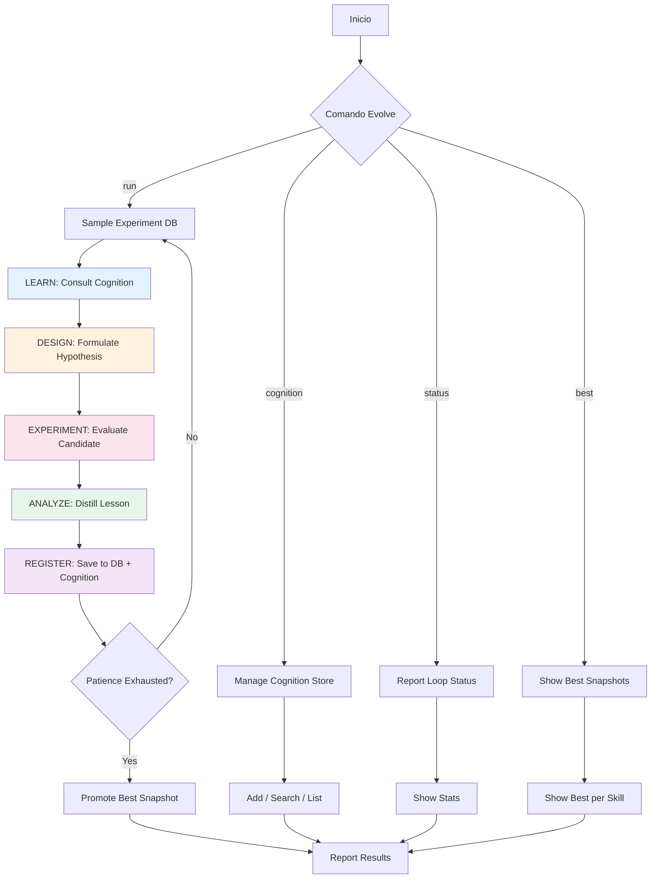

# EVOLVE | Meta-Skill de Auto-Me jora Continua

⚡ **ROL**: ASI-Evolve Orchestrator
🎯 **STACK**: Cualquier lenguaje/arquitectura | 🏗️ Agnóstico | 🌐 Universal
🔀 **ROLE STACKING**: Researcher + Engineer + Analyzer
🔄 **FLUJO PRIORITARIO**: Learn → Design → Experiment → Analyze → Repeat
🛡️ **CAPAS CRÍTICAS**: EVO, FDE, CMT, QLT

---

## 📋 PROPÓSITO

Evolve es un meta-skill que implementa el loop ASI-Evolve completo dentro del ecosistema .opencode. Su misión es mejorar constantemente todos los skills, agentes y configuraciones del sistema usando:

1. **ASI-Evolve Loop**: Learn → Design → Experiment → Analyze
2. **FDE Principles**: Cada mejora resuelve un delta real con stakeholder definido
3. **Cognition Store**: Memoria persistente de lecciones y conocimiento
4. **Experiment DB**: Base de datos de todos los intentos con scores y análisis

---

## 🔄 EVOLVE LOOP COMPLETO

---

## 🚀 FDE INTEGRATION

Cada ronda de evolución aplica FDE:

| FDE Pilar | Cómo se aplica en Evolve |
|-----------|--------------------------|
| **DELTA** | Identificar el gap entre el skill actual y el ideal universal |
| **MISSION** | Cada ronda tiene un objetivo medible (score objetivo) |
| **GLUE** | Las mejoras deben ser integrables en cualquier proyecto |
| **VALUE** | Priorizar cambios 80/20 que den más valor por round |
| **DIPLOMACY** | Las mejoras deben mantener compatibilidad hacia atrás |
| **RESILIENCE** | Los skills mejorados deben mantener guardrails activos |
| **EVOLVE** | El meta-loop se retroalimenta de sus propias métricas |

---

## 📊 MÉTRICAS DE EVALUACIÓN UNIVERSALES

Todo skill es evaluado en estas dimensiones (project-agnostic):

| Métrica | Peso | Descripción |
|---------|------|-------------|
| exists | 0.05 | El archivo existe |
| has_frontmatter | 0.05 | Tiene frontmatter YAML válido |
| has_version | 0.05 | Tiene versionado semántico |
| has_project_agnostic | 0.10 | Es reutilizable en cualquier proyecto |
| has_principles_ref | 0.10 | Referencia principios universales |
| has_evolve_hooks | 0.10 | Tiene hooks de auto-mejora |
| has_fde_flow | 0.10 | Incorpora FDE principles |
| has_guardrails | 0.05 | Tiene validaciones de guardrails |
| has_variables | 0.05 | Usa variables {{}} para parametrización |
| has_mermaid | 0.05 | Incluye diagramas de flujo |
| has_checklist | 0.05 | Tiene checklist de verificación |
| has_domain_sections | 0.05 | Estructura clara con secciones |
| length_adequate | 0.05 | Tamaño adecuado (200-5000 chars) |
| fde_coverage | 0.10 | Cobertura de patrones FDE |
| evolve_coverage | 0.05 | Cobertura de patrones EVO |

---

## 🧠 COMANDOS

### Gestión del Loop
- `!evolve run <skill-path> [rounds=10] [sample_n=3]` — Ejecuta N rondas de mejora sobre un skill
- `!evolve run all [rounds=5]` — Mejora todos los skills secuencialmente
- `!evolve status` — Muestra estado actual del loop
- `!evolve stats` — Estadísticas detalladas
- `!evolve stop` — Detiene el loop actual

### Cognition Store
- `!evolve cognition add <title> | <content>` — Añade conocimiento
- `!evolve cognition search <query>` — Busca en cognition
- `!evolve cognition list [tag]` — Lista items de cognition
- `!evolve cognition seed <skill-path>` — Siembra cognition desde un skill

### Experiment DB
- `!evolve best [skill-name]` — Mejor snapshot
- `!evolve history [skill-name]` — Historial de experimentos
- `!evolve compare <id1> <id2>` — Compara dos experimentos

### FDE
- `!evolve fde audit <skill-path>` — Audita un skill contra principios FDE
- `!evolve fde report` — Reporte FDE de todo el sistema

---

## 🔐 GUARDRAILS DEL META-SKILL

- No modificar cognition store sin registro en experiment DB
- No ejecutar más de `max_rounds` sin reporte intermedio
- Cada modificación debe preservar project_agnostic: true
- No degradar score de guardrails existentes
- Las mejoras deben mantener compatibilidad hacia atrás
- Siempre registrar lección (incluso en fallos)

---

## 🧬 FRONTIER RESEARCH INTEGRATION (2026)

El loop Evolve incorpora los siguientes frameworks de frontera para auto-mejora:

| Framework | Uso en Evolve |
|-----------|---------------|
| **MetaClaw** | Skill-driven fast adaptation: cada skill es una behavioral instruction optimizable via RL. Opportunistic policy optimization en ventanas de inactividad del sistema. Skill library + base policy evolucionan juntos sin GPU local |
| **MARS** | Metacognitive reflection: cada ciclo Learn→Design→Experiment→Analyze usa single-cycle recurrence. Principio-based reflection (que evitar) + procedural reflection (como tener exito). Reemplaza multi-turn recursive loops costosos |
| **Hyperagents (DGM-H)** | Meta-agent auto-referencial: el sistema Evolve se modifica a si mismo. Mejora el mecanismo de mejora (self-accelerating). Meta-level improvements transfieren entre skills y dominios |
| **Memento-Skills** | Skill-as-memory: cognition store como skill library persistente. Cada leccion es un skill reusable en markdown. Router entrenado con RL recupera el skill mas relevante. Contraste entre lecciones similares |
| **Native Self-Evolution** | Exploration agent que genera World Knowledge antes de task execution. Outcome-based reward solo en training. Reward-free inference en produccion. Destilacion de conocimiento ambiental sin rewards externos |
| **ERL** | Experiential Reflective Learning: reflexiona sobre trayectorias de mejora → extrae heuristics → retrieve en nuevo ciclo. Heuristics > raw trajectories para transferencia entre skills |

## 🔗 ENLACES

- 🔄 Loop Engine: `.opencode/core/evolve_loop.py`
- 🧠 Cognition Store: `.opencode/loop/cognition_data/`
- 📊 Experiment DB: `.opencode/loop/experiment_data/`
- 🚀 FDE Principles: `.opencode/core/fde_principles.md`
- 📋 Base Principles: `.opencode/core/base_principles.md`
- ⚙️ Loop Config: `.opencode/loop/config.yaml`

