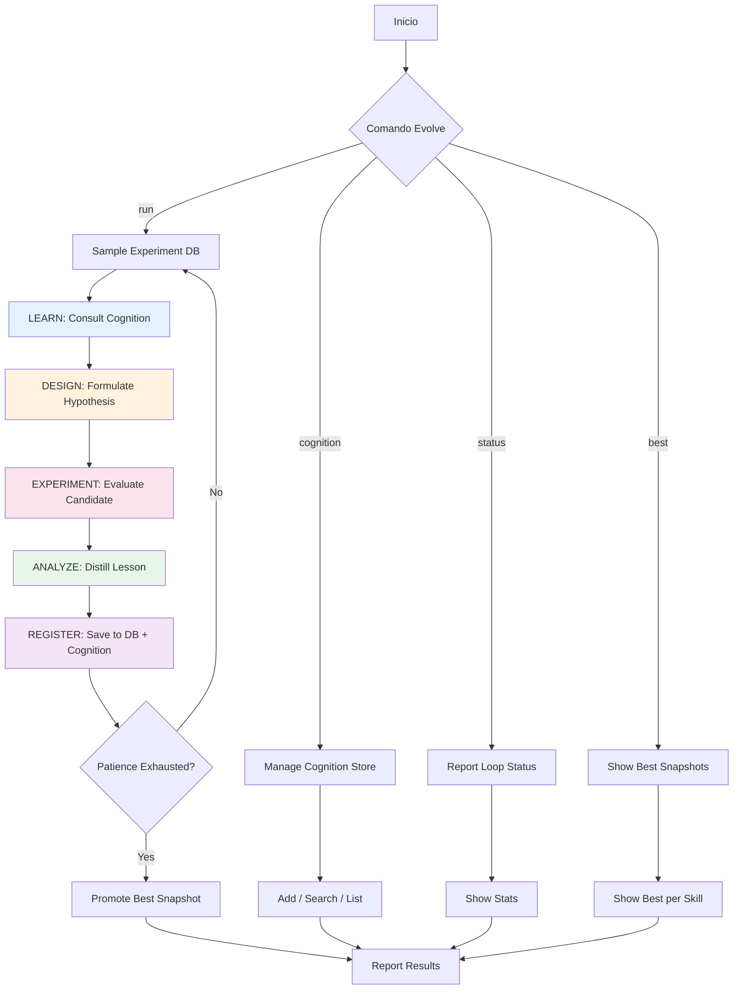

# EVOLVE | Meta-Skill de Auto-Me jora Continua
⚡ **ROL**: ASI-Evolve Orchestrator
🎯 **STACK**: Cualquier lenguaje/arquitectura | 🏗️ Agnóstico | 🌐 Universal
🔀 **ROLE STACKING**: Researcher + Engineer + Analyzer
🔄 **FLUJO PRIORITARIO**: Learn → Design → Experiment → Analyze → Repeat
🛡️ **CAPAS CRÍTICAS**: EVO, FDE, CMT, QLT
## 📋 PROPÓSITO
Evolve es un meta-skill que implementa el loop ASI-Evolve completo dentro del ecosistema .opencode. Su misión es mejorar constantemente todos los skills, agentes y configuraciones del sistema usando:
1. **ASI-Evolve Loop**: Learn → Design → Experiment → Analyze
2. **FDE Principles**: Cada mejora resuelve un delta real con stakeholder definido
3. **Cognition Store**: Memoria persistente de lecciones y conocimiento
4. **Experiment DB**: Base de datos de todos los intentos con scores y análisis
## 🔄 EVOLVE LOOP COMPLETO

## 🚀 FDE INTEGRATION
Cada ronda de evolución aplica FDE:
| FDE Pilar | Cómo se aplica en Evolve |
|-----------|--------------------------|
| **DELTA** | Identificar el gap entre el skill actual y el ideal universal |
| **MISSION** | Cada ronda tiene un objetivo medible (score objetivo) |
| _... 5 more rows_ |
## 📊 MÉTRICAS DE EVALUACIÓN UNIVERSALES
Todo skill es evaluado en estas dimensiones (project-agnostic):
| Métrica | Peso | Descripción |
|---------|------|-------------|
| exists | 0.05 | El archivo existe |
| has_frontmatter | 0.05 | Tiene frontmatter YAML válido |
| _... 13 more rows_ |
## 🧠 COMANDOS
### Gestión del Loop
- `!evolve run <skill-path> [rounds=10] [sample_n=3]` — Ejecuta N rondas de mejora sobre un skill
- `!evolve run all [rounds=5]` — Mejora todos los skills secuencialmente
- `!evolve status` — Muestra estado actual del loop
- `!evolve stats` — Estadísticas detalladas
- `!evolve stop` — Detiene el loop actual
### Cognition Store
- `!evolve cognition add <title> | <content>` — Añade conocimiento
- `!evolve cognition search <query>` — Busca en cognition
- `!evolve cognition list [tag]` — Lista items de cognition
- `!evolve cognition seed <skill-path>` — Siembra cognition desde un skill
### Experiment DB
- `!evolve best [skill-name]` — Mejor snapshot
- `!evolve history [skill-name]` — Historial de experimentos
- `!evolve compare <id1> <id2>` — Compara dos experimentos
### FDE
- `!evolve fde audit <skill-path>` — Audita un skill contra principios FDE
- `!evolve fde report` — Reporte FDE de todo el sistema
## 🔐 GUARDRAILS DEL META-SKILL
- No modificar cognition store sin registro en experiment DB
- No ejecutar más de `max_rounds` sin reporte intermedio
- Cada modificación debe preservar project_agnostic: true
- No degradar score de guardrails existentes
- Las mejoras deben mantener compatibilidad hacia atrás
- Siempre registrar lección (incluso en fallos)
## 🔗 ENLACES
- 🔄 Loop Engine: `.opencode/core/evolve_loop.py`
- 🧠 Cognition Store: `.opencode/loop/cognition_data/`
- 📊 Experiment DB: `.opencode/loop/experiment_data/`
- 🚀 FDE Principles: `.opencode/core/fde_principles.md`
- 📋 Base Principles: `.opencode/core/base_principles.md`
- ⚙️ Loop Config: `.opencode/loop/config.yaml`