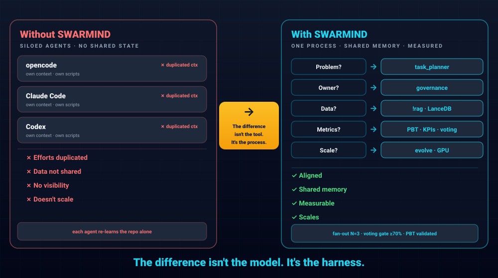

# Swarmind Multi-Agent Harness


[](harness/tests/)
[](harness/validation/)
[](docs/src/es/roadmap/estado.md)
[](docs/src/es/roadmap/estado.md)
[](pyproject.toml)
[](https://github.com/astral-sh/ruff)
[](.pre-commit-config.yaml)
[](harness/tests/)
[](https://github.com/MauricioFCC/SWARMIND/actions/workflows/ci.yml)
[](LICENSE)

> **Spanish (es)** is the primary documentation language; this README is in English for GitHub.

Swarmind is a Python multi-agent orchestration harness for coordinating AI coding agents (opencode, Claude Code, Codex) through a single, modular engine. It is 100% TDD, adversarial, evolutionary, and built to the frontier of 2026 practices: a fan-out orchestrator with governed voting, heuristic model routing with fallback, real PBT and mutation validation oracles, central portable memory with vector search, token economics, and CUDA GPU acceleration.

## Contents 📑

- [Quickstart](#quickstart)
- [Features](#features)
- [Architecture](#architecture)
- [Installation](#installation)
- [Usage](#usage)
- [Memory & Backup](#memory--backup)
- [Token Economics](#token-economics)
- [GPU Acceleration](#gpu-acceleration)
- [Development & Quality Gates](#development--quality-gates)
- [Project Structure](#project-structure)
- [Documentation](#documentation)
- [License](#license)

## Quickstart

Clone, set up, and verify the harness in a few steps:

```bash
# 1. Clone
git clone https://github.com/MauricioFCC/SWARMIND.git
cd SWARMIND

# 2. One-command cross-platform setup (verifies Python 3.12+, installs uv, uv sync,
#    symlinks config to opencode global, installs hooks, verifies import)
./scripts/install.sh        # Linux / macOS
#  .\scripts\install.ps1     # Windows (PowerShell, symlink fallback to copy)

# 3. Run the test suite
uv run python -m pytest harness/tests/ -q

# 4. Optional: enable CUDA GPU acceleration (reinstalls the torch CUDA wheel)
python scripts/enable_gpu.py

# 5. Launch the interactive menu
launcher.bat   # Windows
# or: python -m harness
```

> **Alternative:** `python scripts/setup_swarmind.py` performs the same auto-setup
> (Windows-oriented, uses copy instead of symlinks). Use `install.sh` / `install.ps1`
> for idempotent, symlink-based setup on any OS.

## Features

### Core Orchestration
- ParallelExecutors with native fan-out (`harness/orchestrator/parallel_executor.py`, `ThreadPoolExecutor`, `max_workers=3`) and governed voting (gate score ≥ 70 and confidence < 0.7, N=3). Inspired by the 2026 ORCA analysis: stablyai/orca was evaluated and discarded as a tool; its parallelism/voting was adopted natively instead.
- Task planning and orchestration, agent bus, MARS scheduler, MetaClaw, adaptive planning, debate orchestration, worktable, and workflows.
- `harness/run_commands/` package for interactive commands (`!rag`, `!db`, `!iteration`) and a multi-harness layer with adapters + CLI.

### Process over Tools

The difference isn't the model. It's the harness. An agent without a harness is an isolated department: duplicated effort, no shared memory, no scaling, no measurement. Every new tool/MCP/model is adopted as an orchestrated process (fan-out, governed voting ≥70, SSOT memory, PBT/mutation oracles) or discarded — see the ORCA 2026 case (stablyai/orca dropped as a tool, its parallel/voting process adopted natively).



### Model Routing & Token Economics
- Heuristic `ModelRouter` (`harness/model_router/complexity_router/`) with small/frontier signals and `route_with_fallback` (confidence < 0.7 falls back to the frontier model).
- `MultiAPIProvider` with failover and health-checks (`harness/model_router/multi_provider/`, `harness/model_router/provider_health/`).
- Token budget SSOT (`token_budgets.yaml`), cache-shape (-38%), structured compaction (-41%), governed voting, and budget enforcement via `TokenBudgetManager`.

### Local Ollama Delegation
- The harness can delegate tasks to local models through Ollama (`harness/model_router/ollama_client.py` + `harness/model_router/ollama_tiers.py`), with four capability tiers plus a coding tier, all running current 2026 models installed locally: fast (`qwen3:4b`), quality (`deepseek-r1:8b`), coding (`qwen2.5-coder:7b`), embedding/RAG (`qwen3-embedding:0.6b`) and vision (`qwen3-vl:4b`) — fully configurable (no hardcode) in `.opencode/config/ollama_models.yaml` (base_url, timeout, warm_on_start, per-tier keep_alive/auto_pull).
- Hot models are kept resident with `keep_alive: "5m"` (warm/unload via `/api/ps`) and are auto-installed with `ollama pull` when missing (`auto_pull: true`), so simple tasks run fully local: **0 cloud tokens** (TKN).
- If Ollama is unavailable or a tier's model is missing, the router degrades to the existing cloud `ModelRouter`/`SlmRouter` fallback.

### Frontier 2026 Modules (ADR-0065 .. 0073)
- **LLM-grep for code** (`harness/memory_rag/llm_grep.py`): ripgrep-first 3-layer search (lexical `rg` → structural `ast-grep` → semantic `HybridRetriever` last resort), compaction-friendly output (`path:line` + 2 context lines, dedup, byte budget), auditable routing report (`semantic_ratio` misrouting alert) — ADR-0067.
- **Post-compaction re-anchor** (`harness/memory_rag/reanchor.py`): condensed `<<RE-ANCHOR>>` block (N1 + active role + skills + task) re-injected after every compaction; summaries retain ~17% of session constraints, the block restores >90% (65% of enterprise agent failures are context drift, not token exhaustion) — ADR-0070.
- **Cascade routing (STEER-lite)** (`harness/model_router/cascade_router.py`): try small first, escalate to frontier when confidence < 0.7, `force_tier` escape hatch, per-attempt cost accounting for offline threshold calibration — ADR-0068.
- **Session-affinity routing (SAAR)** (`harness/model_router/session_affinity.py`): sticky model tier per session with TTL; avoids repeated model switches (frontier: −79% switches, −78.7% cost) and keeps prefix caches warm — ADR-0073.
- **Batch voting k-in-1** (`harness/orchestrator/batch_vote.py`): k votes in one API call via the `n` parameter (input charged once instead of k×), automatic fallback to k sequential calls, quorum-gated majority — ADR-0073 (arXiv 2604.13717).
- **Structured-output enforcer** (`harness/orchestrator/structured_enforcer.py`): JSON-schema validation with error-feedback retries (99.9% schema adherence vs <70% unconstrained; 30× fewer parse failures) — ADR-0073.
- **Cache health diagnostics** (`TokenUsageTracker.cache_health`): flags structural cache-busters (hit ratio < 60% with ≥10K volume — timestamps in system, reordered few-shots, dynamic tool lists) — ADR-0068.
- **PEC universal in skills**: all 34 skills carry an expert persona + canonical frontier references per specialty (OWASP for security, HL7 FHIR for healthtech, Rust API Guidelines, RICOUI Brands for UI...) + anti-hedging rule (`scripts/apply_pec.py`, 171 tests) — ADR-0072.
- **Universal principles v3.0.0**: 36 numbered principles with an adherence taxonomy (CHECK vs GUIDE, IFEval/DRFR), post-compaction re-pin rule (RPA) and competition-programming fundamentals (CPD: edges+invariants+BigO checklist, 3-phase repair) — ADR-0070.
- **Ollama CODING tier**: local `qwen2.5-coder:7b` tier with precedence over QUALITY for code tasks — ADR-0069.

### Integrations
- **anydoc — document ingestion for RAG** (`harness/memory_rag/doc_converter.py`): a `DocumentConverter` protocol plus `AnyDocConverter` (lazy, backed by `firecrawl-anydoc>=0.1.9`) converts **21 binary/text extensions** (pdf, docx, doc, pptx, ppt, xlsx, xls, odt, odp, ods, rtf, epub, csv, tsv, html, htm, md, txt, json, yaml, yml) to Markdown before chunking. `DocumentChunker` accepts an injected converter (DI, default `AnyDocConverter`) and raises `DocumentConversionError(path, reason)` when conversion fails — errors are never swallowed. Enable it with `harness/scripts/rag_ingest.py --include-docs` or the interactive `!rag ingest --docs`.
- **deepseek-harness patterns — plugin lifecycle + session replay**: `harness/plugins/registry.py` extends `PluginBase` with `on_load()`/`on_unload()`/`events` (no-op defaults), `ToolRegistry` accepts an optional `event_bus` (DI) and auto-subscribes plugins to `on_{event}` handlers; `load_all()`/`unload_all()` are idempotent. `harness/observability/session_replay.py` provides `SessionReplay` to replay recorded sessions (Markdown/JSON export) with `SessionNotFoundError`. Demo: `harness/plugins/tools/example_tool.py` (`GreeterTool`).

### Memory & RAG
- Central portable memory with LanceDB vector store (`harness/memory_rag/lance_vector_store.py`), semantic cache, SQLite-vec adapter (edge/offline backend), federated search, context window management, and `shapley_flow` optimization.
- **Hybrid RAG (RRF)** (`harness/memory_rag/hybrid_retriever.py`): `HybridRetriever` fuses dense vector (LanceDB embeddings) and sparse BM25 (SQLite FTS5) rankings with **Reciprocal Rank Fusion** (k=60) — documents present in both rankings rank higher; DI over `FTSSearch` + `LanceVectorStore`.
- **Corrective RAG (CRAG)** (`harness/memory_rag/corrective_retriever.py`): `CorrectiveRetriever` validates retrieval quality *before* generation (arXiv:2401.15884) — if poor, applies query rewrite or falls back to an alternative source, reporting the `corrective_action` taken (`none`/`rewrite`/`fallback`).
- `AgentKPITracker`, compression strategies, context assembler, token budget managers, and skill loader.

### Validation (PBT & Mutation Oracles)
- `harness/validation/pbt_stage.py`: a real Hypothesis oracle running in a subprocess with 5 invariants (no_crash, returns_value, output_list, deterministic, commutative).
- `harness/validation/mutation_stage.py`: AST mutation with isolated subprocess execution.

### GPU Acceleration
- CUDA 12.6, RTX 4060 8GB, torch 2.13.0+cu126.
- `harness/gpu_accel.py` + `harness/gpu_optimize.py` with measured speedups: vector search **x10.9 (10k)**, **x9.2 (100k)**, and embeddings at **41µs/msg**.
- `scripts/enable_gpu.py` reinstalls the torch CUDA wheel after every `uv sync`.

### Developer Experience
- One-command setup (`scripts/setup_swarmind.py`) and config menu (`config_swarmind.py`).
- CPU-only PyPI torch wheel replaced by the CUDA wheel through a single script, portable across Linux/Mac/Windows.
- Full test suite, ruff-clean code, zero dead code (vulture), and zero architecture debt.

## Architecture

```
┌─────────────────────────────────────────────────────────────┐
│                        AGENTS LAYER                          │
│        opencode · Claude Code · Codex (multi-harness)       │
└───────────────────────────┬─────────────────────────────────┘
                            │
┌───────────────────────────▼─────────────────────────────────┐
│                 ORCHESTRATION LAYER                          │
│  harness/orchestrator/                                       │
│   parallel_executor (fan-out + voting) · task_orchestrator   │
│   task_planner · agent_bus · mars_scheduler · metaclaw       │
│   debate_orchestrator · workflows · worktable                │
│   run_commands/ (commands) · multi_harness (adapters+cli)    │
└───────────────────────────┬─────────────────────────────────┘
                            │
┌───────────────────────────▼─────────────────────────────────┐
│               MODEL ROUTING LAYER                            │
│  harness/model_router/                                       │
│   complexity_router (small/frontier) · route_with_fallback   │
│   multi_provider (failover + health-checks) · provider_health│
└───────────────────────────┬─────────────────────────────────┘
                            │
┌───────────────────────────▼─────────────────────────────────┐
│                    MEMORY & RAG LAYER                        │
│  harness/memory_rag/                                         │
│   lance_vector_store · semantic_cache · sqlite_vec_adapter   │
│   federated_search · shapley_flow · context_window_manager   │
│   doc_converter · doc_ingester (binaries → Markdown → RAG)   │
│   hybrid_retriever (RRF dense+sparse) · corrective_retriever │
│   token_budget · token_budget_manager                        │
└───────────────────────────┬─────────────────────────────────┘
                            │
┌───────────────────────────▼─────────────────────────────────┐
│                    VALIDATION LAYER                          │
│  harness/validation/                                         │
│   pbt_stage.py (Hypothesis oracle, subprocess, 5 invariants) │
│   mutation_stage.py (AST mutation, isolated subprocess)      │
└───────────────────────────┬─────────────────────────────────┘
                            │
┌───────────────────────────▼─────────────────────────────────┐
│                    ACCELERATION LAYER                        │
│  harness/gpu_accel.py · harness/gpu_optimize.py              │
│  CUDA 12.6 · torch 2.13.0+cu126 · RTX 4060 8GB              │
└──────────────────────────────────────────────────────────────┘
```

Each layer is a dedicated package under `harness/`: the orchestration layer coordinates agents with parallel execution and governed voting; the routing layer dispatches requests to small or frontier models with automatic fallback and provider failover; the memory layer centralizes knowledge in a portable vector store; the validation layer enforces quality with real property-based and mutation oracles; and the acceleration layer offloads compute to the GPU where available.

## Installation

### Requirements

- **Python 3.12+**
- **[uv](https://github.com/astral-sh/uv)** as package/dependency manager
- Optional: NVIDIA GPU with CUDA 12.6 (e.g. RTX 4060 8GB)

### Setup

**One command, any OS** (idempotent, symlink-based, fallback to copy on Windows
without Developer Mode):

```bash
git clone https://github.com/MauricioFCC/SWARMIND.git
cd SWARMIND
./scripts/install.sh        # Linux / macOS
#  .\scripts\install.ps1     # Windows (PowerShell)
```

The installer verifies Python 3.12+, installs [uv](https://github.com/astral-sh/uv)
if missing, runs `uv sync`, creates symlinks from `~/.config/opencode/` to the repo
(config, agents, skills), installs the pre-commit hooks (`git config core.hooksPath
.githooks`), and verifies the harness imports. Re-running it is safe.

**Alternative** (Windows-oriented, copy-based):

```bash
python scripts/setup_swarmind.py
```

`setup_swarmind.py` verifies Python 3.12+, installs uv if missing, runs `uv sync`,
syncs the configuration to the opencode global directory, and creates the central
memory store. An interactive config menu is available via `config_swarmind.py`.

### GPU (optional)

The PyPI torch wheel resolved by the lockfile is CPU-only on Windows/Linux. After setting up, activate CUDA with:

```bash
python scripts/enable_gpu.py
```

This reinstalls the torch CUDA wheel and verifies it. **Important:** do not run `uv sync` after enabling CUDA, otherwise the CPU wheel is restored and the CUDA binary is lost; re-run `python scripts/enable_gpu.py` after any `uv sync`.

### Portability

The harness is portable across Linux, macOS, and Windows. Path resolution uses a resilient `_safe_home()` that does not depend on `HOME`, and the central memory store plus its backups live under a configurable root.

## Usage

Launch the interactive harness and delegate tasks to agents:

```bash
python -m harness
```

Available entry points include:

- `delegate` — assign a task to a specific coding agent (opencode, Claude Code, Codex).
- `run` — execute a task through the orchestration pipeline.
- `scheduler` — schedule recurring agent runs (`harness/scheduler/`).
- Iteration pipeline — run a full iteration loop: plan, parallel fan-out, governed voting, validation, and memory persistence.

Interactive commands (`harness/run_commands/`):

- `!rag` — query the vector store.
- `!db` — database inspection / maintenance.
- `!iteration` — trigger the iteration pipeline on demand.

## Memory & Backup

Central memory is the single source of truth (SSOT):

- Default root: `~/Documents/Memory_Proyects` (override with `MEMORY_ROOT`).
- Contains `data/lancedb` plus backups.

Resolution priority in `memory_config.py`:

1. `LANCEDB_PATH` environment variable
2. `.swarmind_config.json` (`MEMORY_ROOT`)
3. Legacy `harness/db/lancedb`

Backups are managed with `scripts/backup_memory.py`:

```bash
python scripts/backup_memory.py --list      # list existing backups
python scripts/backup_memory.py --schedule  # register a scheduled backup
```

Duplicated databases were eliminated (7.5 GB reclaimed). The memory layout is portable across Linux, macOS, and Windows via a resilient `_safe_home()` that works without `HOME`.

## Token Economics

- **Model routing**: `harness/model_router/complexity_router/` emits small/frontier signals; `route_with_fallback` sends low-confidence requests (confidence < 0.7) to the frontier model.
- **Cascade routing**: `cascade_router` tries small first and escalates on low confidence (STEER-lite), with per-attempt cost accounting; `session_affinity` keeps the tier sticky per session to avoid prefill re-payments.
- **Governed voting**: `ParallelExecutor` fans out to N=3 agents when the gate score is ≥ 70 and confidence < 0.7, with a budget of `MAX_TOKENS_BY_AGENT × 3`; `batch_vote` charges input once for k votes (the `n` parameter) with fallback.
- **Structured outputs**: `structured_enforcer` validates every machine-readable verdict against a JSON schema with error-feedback retries (30× fewer parse failures).
- **Token budgets**: budgets are the single source of truth (`token_budgets.yaml`), enforced by `TokenBudgetManager`; `cache_health` flags structural cache-busters (hit < 60% with volume).
- **Measured savings**: cache-shape -38%, structured compaction -41%.

## GPU Acceleration

The harness auto-detects the GPU via `harness/gpu_accel.py` and optimizes tensor operations with `harness/gpu_optimize.py`.

- Environment: CUDA 12.6, RTX 4060 8GB, torch 2.13.0+cu126.
- Measured speedups:
  - Vector search **x10.9** (10k vectors), **x9.2** (100k vectors)
  - Embeddings **41µs/msg**

Enable it with:

```bash
python scripts/enable_gpu.py
```

**Warning:** never run `uv sync` after enabling CUDA — the lockfile resolves the CPU torch wheel from PyPI and the CUDA binary is lost. Re-run `python scripts/enable_gpu.py` after every `uv sync`.

## Development & Quality Gates

Quality is enforced continuously, not at the end:

- **Test suite**: 5160 tests collected (TDD suite), mutation testing mutmut gate ≥70%.
- **Lint**: ruff — all checks passed.
- **Dead code**: vulture — 0 dead code.
- **Architecture debt (AGR)**: 0 files over 500 lines in non-test code; 32 flat modules refactored into packages with re-exporting `__init__.py`; mixins limited to ≤ 2 bases; SOLID corrected in 9 classes.
- **Validation oracles**: real Hypothesis property-based tests (`pbt_stage.py`, 5 invariants) and AST mutation testing (`mutation_stage.py`) run in isolated subprocesses.
- **TDD**: strictly always-on (RED → GREEN → REFACTOR), backed by WAL before expensive runs.

## Project Structure

```
SWARMIND/
├── harness/                       # Core engine (Python 3.12+, packages per domain)
│   ├── orchestrator/              # agent_bus, task_planner, task_orchestrator,
│   │                              # mars_scheduler, metaclaw, adaptive_planner,
│   │                              # natural_language_tools, tool_guardian, hitl,
│   │                              # multi_user_governance, organizational_layer,
│   │                              # health, federated_memory, agent_discovery,
│   │                              # debate_orchestrator, worktable, workflows,
│   │                              # multi_harness (adapters+cli), parallel_executor.py
│   ├── model_router/              # complexity_router, multi_provider,
│   │                              # provider_health, ollama_client, ollama_tiers
│   ├── memory_rag/                # lance_vector_store, semantic_cache,
│   │                              # sqlite_vec_adapter, federated_search,
│   │                              # agent_kpi_tracker, vector_store_adapter,
│   │                              # context_window_manager, compression_strategies,
│   │                              # shapley_flow, optimization_pipeline,
│   │                              # context_assembler, token_budget,
│   │                              # token_budget_manager, skill_loader,
│   │                              # doc_converter, doc_ingester (anydoc),
│   │                              # hybrid_retriever (RRF), corrective_retriever (CRAG)
│   ├── evolve_loop/               # agent_builder, skill_generator, prompt_evolver,
│   │                              # gepa_mutator, nudge_system, evaluator,
│   │                              # self_improver, procedural_memory, cognition_sync
│   ├── validation/                # pbt_stage.py, mutation_stage.py (oracles reales)
│   ├── security/                  # zero_trust.py
│   ├── hooks/                     # hook_manager, hook_registry, builtin_hooks
│   ├── observability/             # OpenTelemetry, logging, session_replay
│   ├── qa/                        # detector, generator, orchestrator, predictor
│   ├── gateway/                   # Slack/Telegram/CLI gateways
│   ├── parallel/                  # adaptive_pool, io_fusion, pipeline_macu
│   ├── benchmarks/                # bench_memory, bench_routing, bench_cache, ...
│   ├── plugins/                   # plugin lifecycle (on_load/on_unload/events) + tools
│   ├── run_commands/              # interactive commands (!rag, !db, !iteration)
│   ├── scheduler/                 # scheduled runs (Simple/Lance schedulers)
│   ├── db/                        # migrate_engine, iteration_reports
│   ├── tools_sandbox/             # MCP client, mcp_executor, mcp_manager
│   ├── aifactory/                 # factory, agent_factory
│   ├── guardrails/                # guardrail_engine
│   ├── evals/                     # eval_factory
│   ├── context/                   # token_budget_router, skill_contract
│   ├── scripts/                   # init, rag_ingest, end_of_iteration, ...
│   └── tests/                     # 176+ test files (5160 tests)
├── scripts/                       # Repo-level tooling
│   ├── setup_swarmind.py          # one-command setup (Python 3.12+, uv, uv sync, sync global, central memory)
│   ├── enable_gpu.py              # reinstall torch CUDA wheel after uv sync
│   ├── backup_memory.py           # central memory backups (--list / --schedule)
│   ├── config_swarmind.py         # interactive config menu
│   ├── sync_opencode_global.py    # sync to opencode global
│   ├── deploy_all.py              # propagate .opencode to 10 projects
│   ├── gen_docs_api.py            # API reference Markdown via Griffe (AST)
│   ├── audit_docstrings.py        # DOC gate: 0 functions without docstring
│   ├── quality_audit.py           # AGR audit (<900LC, except:pass, docstrings)
│   ├── tdad_select.py             # test dependency graph (AST)
│   └── validate_skills.py         # skills spec validation (--strict)
├── docs/
│   ├── src/es/                    # Documentation (Spanish, primary language)
│   │   ├── api/                   # API reference generated by gen_docs_api.py
│   │   ├── roadmap/estado.md
│   │   └── guide/, technical/, reference/, skills/
│   ├── src/en/SUMMARY.md
│   └── .MEJORAS_SWARMIND.md
├── .opencode/                     # agents (23), skills (34, PEC universal), config — SSOT
├── CHANGELOG.md
├── pyproject.toml
└── README.md
```

## Documentation

- [Documentation (ES) — primary language](docs/src/es/) — full docs in Spanish, the main documentation language.
- [English summary](docs/src/en/SUMMARY.md)
- [Roadmap](docs/src/es/roadmap/estado.md)
- [Skills registry + residency tiers](docs/src/es/skills/registry.md) — 34 skills, PEC universal, REFERENCE/SAVED/INSTALLED
- [CHANGELOG](CHANGELOG.md)
- [Improvements log](docs/.MEJORAS_SWARMIND.md)

## License

[MIT](LICENSE)