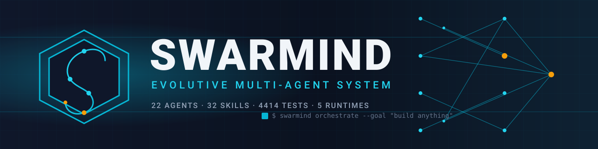
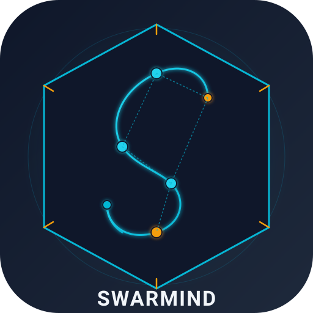
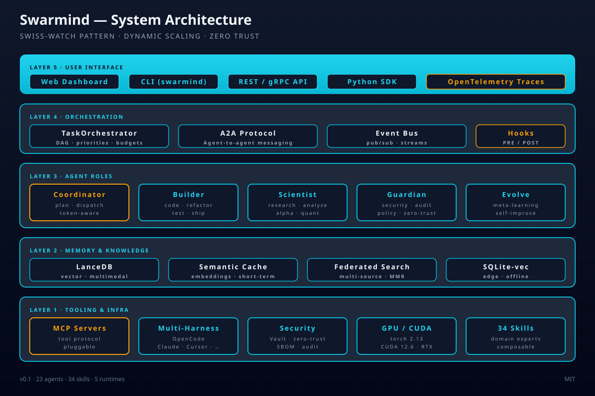

<div align="center">



**Swarmind** — Evolutive Multi-Agent System

[](https://github.com/MauricioFCC/SWARMIND/actions/workflows/ci.yml)
[](https://github.com/MauricioFCC/SWARMIND/actions/workflows/codeql.yml)
[](https://github.com/MauricioFCC/SWARMIND)
[](LICENSE)
[](pyproject.toml)
[](https://github.com/astral-sh/ruff)
[](.pre-commit-config.yaml)
[](harness/tests/)
[](docs/src/es/adr/README.md)
[](.opencode/skills/)
[](.opencode/agents/)

[Documentación](docs/src/en/SUMMARY.md) · [Quickstart](#quickstart) · [Architecture](#architecture) · [Contributing](CONTRIBUTING.md)

</div>

# Swarmind — Evolutive Multi-Agent System



**Swarmind** is a multi-agent system for orchestration, execution, and continuous self-improvement with 31 contextual skills, multi-level orchestration, GPU acceleration, and token economics.

## Quickstart

```bash
# 1. Clone
git clone https://github.com/MauricioFCC/SWARMIND.git
cd SWARMIND

# 2. Install dependencies (uses uv — fast Rust-based package manager)
pip install uv
uv sync

# 3. Run tests
uv run python -m pytest harness/tests/ -q

# 4. Launch interactive menu
launcher.bat   # Windows
# o: python harness/run.py
```

**Or install from PyPI (when published):**

```bash
pip install swarmind-harness
swarmind --help
```

> **Requirements**: Python 3.10+, [uv](https://github.com/astral-sh/uv), optional CUDA-capable GPU.

## Contents

- [What is Swarmind?](#what-is-swarmind)
- [Quickstart](#quickstart)
- [Highlights](#highlights)
- [Current Status](#current-status-july-2026)
- [Architecture](#architecture)
- [Multi-Harness Adapter](#multi-harness-adapter-layer)
- [Documentation](#documentation)
- [15 Papers 2026 Implemented](#15-papers-2026-implemented)
- [Benchmark Projects 2026](#benchmark-projects-2026)
- [Contributing](#contributing)
- [Security](#security)
- [Citation](#citation)
- [License](#license)

## Current Status (July 2026)

| Metric | Value |
|--------|-------|
| Tests | 3420 passing (29 QA + AIFactory verified) |
| Coverage | ~65% (actual 71.56%, target: 80%) |
| ADRs | 32 (all implemented, sequential 0001-0032) |
| Agents | 20 specialized (100% profiles + .min.md) |
| Skills | 31 contextual (100% SKILL.md + SKILL.min.md) |
| Orchestrator Modules | 48 |
| Memory/RAG Modules | 30 |
| Hook Modules | 4 (security_validator, permission_checker, audit_logger, metrics) |
| Security Modules | Zero Trust (TokenManager, PolicyEngine, verify_agent_identity) |
| Multi-Harness Modules | 12 (runtime_detector, converter_base, 5 adapters, CLI) |
| GPU | RTX 4060 8GB (6x search speedup, 3.2x embedding) |
| Token savings | -51% capsules, -40% structured output, -38% cache-shape |
| Projects | 6 active |
| Vector stores | LanceDB, Chroma, Qdrant + SQLite-vec (edge) |
| Federated Search | Parallel 3 backends + MMR re-ranking |
| Observability | OpenTelemetry (traces, metrics, OTLP export) |
| Benchmarks | AgentBenchmark (accuracy, latency, tokens, success) |
| Commits | 200+ |
| Papers implemented | 15 (Gap Analysis 2026) |

## What's New in July 2026

### Multi-Harness Adapter Layer
Swarmind now runs natively on **5 runtimes** without losing OpenCode compatibility:

| Runtime | Detection | Format |
|---------|-----------|--------|
| **OpenCode** | `.opencode/` + OPENCODE_AGENT_MD | Native (SSOT) |
| **Claude Code** | `ANTHROPIC_API_KEY` + `.claude/` | AGENTS.md + settings.json |
| **Codex CLI** | `OPENAI_API_KEY` + `.codex/` | config.toml + prompts/ |
| **Cursor** | `CURSOR_MODE` + `.cursor/` | .cursorrules + agents/ |
| **Gemini CLI** | `GOOGLE_API_KEY` + `.gemini/` | instructions.md |

Usage: `python harness/run.py !harness export --target claude`

### Hook System — Deterministic Automation
4 built-in hooks that the LLM cannot control:

| Hook | Type | Priority | Purpose |
|------|------|----------|---------|
| Security Validator | PRE_TOOL | CRITICAL | Blocks `rm -rf /`, DROP TABLE, etc. |
| Permission Checker | PRE_TOOL | HIGH | Protects .opencode/opencode.json, pyproject.toml |
| Audit Logger | POST_TOOL | NORMAL | Logs every operation to .opencode/audit.log |
| Metrics Collector | ON_NOTIFICATION | LOW | Collects system metrics |

### Zero Trust Architecture
- **TokenManager**: HMAC-SHA256 tokens with automatic rotation
- **PolicyEngine**: Mini-OPA with wildcards and roles
- **verify_agent_identity**: Multi-step verification (token + identity + permissions)

### Federated Vector Search
Parallel search across **LanceDB + Chroma + Qdrant** with MMR re-ranking.

### SQLite-vec Backend
Portable vector backend **with no external dependencies** (ideal for edge/offline).

### Async TaskOrchestrator
Refactored to **full asyncio** with 4.8x speedup (ADR-0017).

## Architecture



```
Swarmind/
├── .opencode/        ← SSOT (agents, skills, config)
├── harness/          ← Execution engine (orchestrator, memory, hooks, security, tests)
├── docs/src/         ← mdbook documentation
└── pyproject.toml
```

For detailed structure, see [Architecture — Swiss Watch Pattern](docs/src/en/architecture/swiss-watch.md).

## Documentation

- [English README](docs/src/en/README.md) — Full documentation entry point
- [Architecture](docs/src/en/architecture/swiss-watch.md) — Swiss Watch Pattern, Dynamic Scaling, Composition
- [Usage Guide (ES)](docs/src/es/guide/como-usar.md) — How to delegate tasks to agents
- [Agents & Skills (ES)](docs/src/es/guide/agentes-y-skills.md) — Detailed system documentation
- [Technical Manual (ES)](docs/src/es/technical/manual-tecnico.md) — Complete harness technical documentation
- [ADR](docs/src/es/adr/README.md) — Architecture Decision Records (32 documents)
- [Skills Registry](docs/src/es/skills/registry.md) — Complete skill registry (31)
- [Roadmap](docs/src/es/roadmap/estado.md) — Project status and next steps

## 15 Papers 2026 Implemented

| Gap | Paper | Implementation |
|-----|-------|---------------|
| Governance Decay | arXiv:2606.22528 | GovernanceGuard |
| Natural Language Tools | arXiv:2607.03953 | NaturalLanguageToolkit |
| Multi-User Governance | arXiv:2606.21856 | MultiUserGovernance |
| Organizational Science | arXiv:2607.25446 | OrganizationalLayer |
| Learned Adaptive Memory | arXiv:2607.13591 | StrategicMemory |
| ToolGuardian Security | arXiv:2607.21835 | ToolGuardian |
| Strategic Forgetting | arXiv:2607.22562 | StrategicMemory (SF-AMS) |
| Agent Capsules | arXiv:2605.00410 | AgentCapsules (-51% tokens) |
| ReDNA Creative AI | arXiv:2605.28465 | CreativeWorktable |
| Diversity Collapse | arXiv:2604.18005 | Worktable config |
| Structured Output | arXiv:2604.12301 | TokenOptimizer (-40%) |
| DAG Parallelism | arXiv:2606.01533 / arXiv:2604.15186 | Kahn Algorithm in TokenOptimizer |
| Knowledge Graph | arXiv:2605.27864 | KnowledgeGraph |
| Swarmind PBT | arXiv:2510.09907 | Hypothesis + PBT Core |
| Legal NLP | SaulLM-7B + MiningLegalBench | LegalAnalyzer |

## Benchmark Projects 2026

Swarmind competes with **ECC** (235k stars), **DeerFlow** (78.1k), **CowAgent** (46.2k) and **CodeWhale** (40.2k). The full capability comparison table is in [Harness Comparison 2026](docs/src/es/reference/comparativa-harness-2026.md).

**Key differentiators:** GPU Acceleration (6x), Token Economics (-51%), Full Governance, Zero Trust, Deterministic Hook System, Multi-Harness (5 runtimes), 15 papers 2026 implemented, 3420 tests.

## Contributing

Contributions are welcome! See [CONTRIBUTING.md](CONTRIBUTING.md) for guidelines. Please read our [Code of Conduct](CODE_OF_CONDUCT.md) first.

## Security

Report vulnerabilities via [SECURITY.md](SECURITY.md) — please do **not** open public issues. For sensitive reports, email `maodevcol@gmail.com`.

## Citation

If you use Swarmind in academic work, see [CITATION.cff](CITATION.cff) for BibTeX/APA entries.

## License

[MIT](LICENSE) © 2026 Swarmind Contributors
